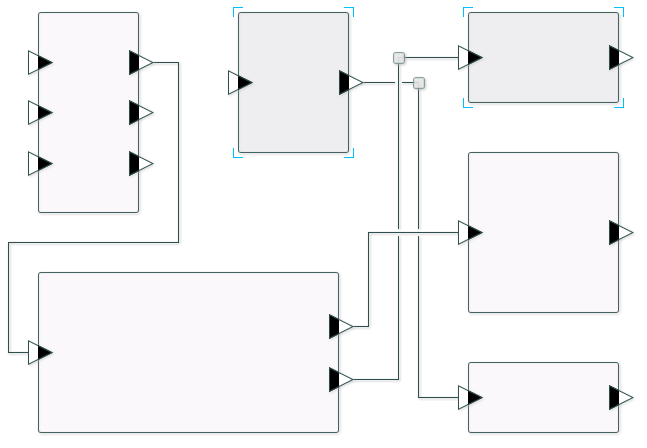

Graph Editor
==========

A library for creating and editing graph-like diagrams in JavaFX.



## Features

**Fully customizable**
+ Customize any visual element of the graph (via CSS or by setting custom skin classes).
+ Specify the connections that are allowed / forbidden.
+ Add your own content inside nodes (text, graphics, forms, other graphs).

**EMF-based**
+ Graph state is stored in an [EMF](http://www.eclipse.org/modeling/emf/ "EMF Project Homepage") model.
+ Undo / redo any action.
+ Serialize graph state easily to / from XML.

**Convenience features**
+ Single & multiple selection.
+ Cut / copy / paste.
+ Alignment & snap-to-grid.
+ Container with a panning mechanism & minimap.

## Demo

Download the demo app [here](https://github.com/tesis-dynaware/graph-editor/releases).

## Use it

Maven coordinates:

    <dependency>
        <groupId>de.tesis.dynaware</groupId>
        <artifactId>de.tesis.dynaware.grapheditor.core</artifactId>
        <version>1.1.1</version>
    </dependency>

Try the tutorials [here](https://github.com/tesis-dynaware/graph-editor/wiki).

## Build it yourself

Requires [Java 8](http://www.oracle.com/technetwork/java/javase/downloads/index.html), [Git](http://git-scm.com/), & [Maven](http://maven.apache.org/).

    git clone https://github.com/tesis-dynaware/graph-editor.git
    cd graph-editor
    mvn clean install
    
The demo jar can be found in ```demo/target/deploy```.
