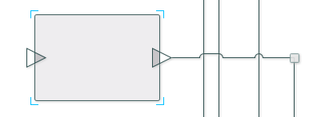
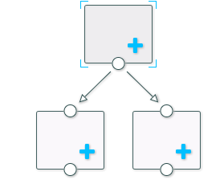
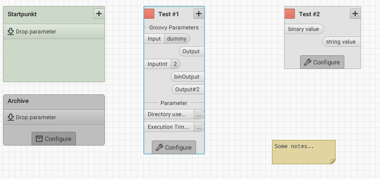

Graph Editor
==========

A library for creating and editing graph-like diagrams in JavaFX.

*This project is a fork of [tesis-dynaware/graph-editor 1.3.1](https://github.com/tesis-dynaware/graph-editor), which is no longer being maintained.*

## Features

+ Highly customizable
+ Add your own custom skins or restyle existing ones via CSS
+ Graphical effects where connections intersect:

+ Full undo / redo functionality via EMF commands
+ Selection API with cut, copy, paste
+ Alignment (optionally with snap-to-grid)
+ Editing of large graphs via a panning mechanism & minimap
+ Additional skin examples provided:

Example of a fully customized implementation:

## Use it

Download the latest [Release](https://github.com/eckig/graph-editor/releases).

Try the tutorials [here](https://github.com/eckig/graph-editor/wiki).

## Demo

Requires [Java 11](https://adoptopenjdk.net/), [Git](http://git-scm.com/) and [Maven](http://maven.apache.org/).

First clone the project:

    git clone https://github.com/eckig/graph-editor.git
    cd graph-editor
    
 1. Import into your favorite IDE
 2. Navigate to the `demo` modules main class `GraphEditorDemo` and launch it.

## Thanks to

 - Jetbrains for the [IntelliJ IDEA](https://www.jetbrains.com/idea/) licenses
