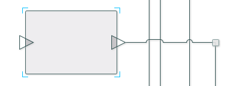
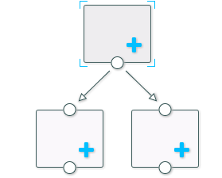
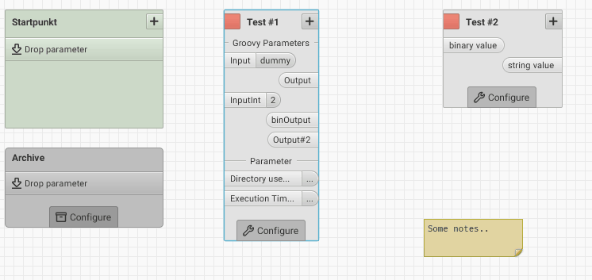

Graph Editor
==========

A library for creating and editing graph-like diagrams in JavaFX.

*This project is a fork of [tesis-dynaware/graph-editor 1.3.1](https://github.com/tesis-dynaware/graph-editor), which is no longer being maintained.*

## Features

+ Highly customizable
+ Add your own custom skins or restyle existing ones via CSS
+ Graphical effects where connections intersect:



+ Full undo / redo functionality via EMF commands
+ Selection API with cut, copy, paste
+ Alignment (optionally with snap-to-grid)
+ Editing of large graphs via a panning mechanism & minimap
+ Additional skin examples provided:



Example of a fully customized implementation:


## Input gestures

| Gesture | Action |
| --- | --- |
| Middle-drag | Pan the view |
| `SPACE` + primary-drag | Pan the view |
| Primary-drag on empty canvas | Rubber-band selection |
| Primary-drag on a node / joint | Move the selection |
| Primary-drag on a node border | Resize the node |
| Primary-drag from a connector | Create a connection |
| `Ctrl` + scroll | Zoom, anchored at the mouse pointer |
| Arrow keys / `Page Up` / `Page Down` / `Home` / `End` | Pan with the keyboard |

The secondary (right) mouse button is intentionally left unhandled, so that
applications using this library are free to attach their own context menus.
Only unmodified navigation keys are consumed, so application shortcuts keep working.

### Localization

Strings used by the graph editor (currently only the ones read out by screen
readers) come from a `ResourceBundle` and can be replaced per editor:

```java
graphEditor.getProperties().setResourceBundle(ResourceBundle.getBundle("com.example.Messages"));
```

Keys that a custom bundle does not define fall back to the shipped English
defaults, so upgrading never breaks an application with incomplete translations.

## Use it

Maven coordinates:
```
<dependency>
  <groupId>io.github.eckig.grapheditor</groupId>
  <artifactId>grapheditor-core</artifactId>
  <version>24.0.10</version>
</dependency>
```
Download the latest [Release](https://github.com/eckig/graph-editor/releases).

Try the [tutorials](https://github.com/eckig/graph-editor/wiki).

## Demo

Run the sample application after cloning the repository with maven inside the `demo` module with `mvn javafx:run`.
